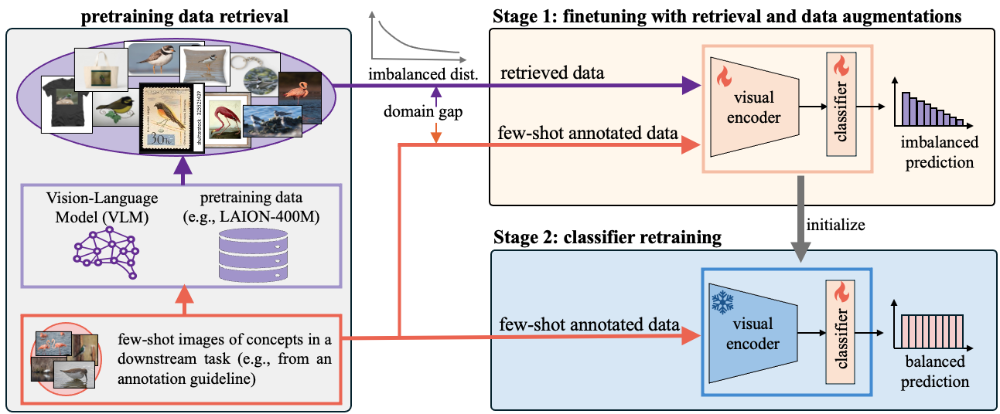

<div align="center">
<h1>Few-Shot Recognition via Stage-Wise Augmented Finetuning</h1>

[**Tian Liu**](https://tian1327.github.io/)<sup>1&dagger;</sup> · [**Huixin Zhang**](https://www.linkedin.com/in/huixin-zhang-a2670a229/)<sup>1</sup> · [**Shubham Parashar**](https://shubhamprshr27.github.io/)<sup>1</sup> · [**Shu Kong**](https://aimerykong.github.io/)<sup>1,2*</sup>

<sup>1</sup>Texas A&M University&emsp;&emsp;&emsp;<sup>2</sup>University of Macau
<br>
&dagger;project lead&emsp;*corresponding author

<a href="https://arxiv.org/abs/2406.11148"></a>
<a href='https://tian1327.github.io/SWAT/'></a>
<!-- <a href='https://huggingface.co/spaces/depth-anything/Depth-Anything-V2'></a>
<a href='https://huggingface.co/datasets/depth-anything/DA-2K'></a> -->
</div>

Our work explores retrieval-augmented learning for few-shot recognition. We propose a novel **Stage-Wise Augmented fineTuning (SWAT)** method to address the `domain gap` and `imbalanced distribution` of retrieved data, outperforming previous works by >10% in accuracy.




## News

- **2024-06-28:** [project page](https://tian1327.github.io/SWAT/) launched.
- **2024-06-17:** [arXiv paper](https://arxiv.org/abs/2406.11148) released.


<!-- ## Pre-trained Models

We provide **four models** of varying scales for robust relative depth estimation:

| Model | Params | Checkpoint |
|:-|-:|:-:|
| Depth-Anything-V2-Small | 24.8M | [Download](https://huggingface.co/depth-anything/Depth-Anything-V2-Small/resolve/main/depth_anything_v2_vits.pth?download=true) |
| Depth-Anything-V2-Base | 97.5M | [Download](https://huggingface.co/depth-anything/Depth-Anything-V2-Base/resolve/main/depth_anything_v2_vitb.pth?download=true) |
| Depth-Anything-V2-Large | 335.3M | [Download](https://huggingface.co/depth-anything/Depth-Anything-V2-Large/resolve/main/depth_anything_v2_vitl.pth?download=true) |
| Depth-Anything-V2-Giant | 1.3B | Coming soon |

## Usage

### Prepraration

```bash
git clone https://github.com/DepthAnything/Depth-Anything-V2
cd Depth-Anything-V2
pip install -r requirements.txt
```

Download the checkpoints listed [here](#pre-trained-models) and put them under the `checkpoints` directory.

### Use our models
```python
import cv2
import torch

from depth_anything_v2.dpt import DepthAnythingV2

model_configs = {
    'vits': {'encoder': 'vits', 'features': 64, 'out_channels': [48, 96, 192, 384]},
    'vitb': {'encoder': 'vitb', 'features': 128, 'out_channels': [96, 192, 384, 768]},
    'vitl': {'encoder': 'vitl', 'features': 256, 'out_channels': [256, 512, 1024, 1024]},
    'vitg': {'encoder': 'vitg', 'features': 384, 'out_channels': [1536, 1536, 1536, 1536]}
}

encoder = 'vitl' # or 'vits', 'vitb', 'vitg'

model = DepthAnythingV2(**model_configs[encoder])
model.load_state_dict(torch.load(f'checkpoints/depth_anything_v2_{encoder}.pth', map_location='cpu'))
model.eval()

raw_img = cv2.imread('your/image/path')
depth = model.infer_image(raw_img) # HxW raw depth map in numpy
```

### Running script on *images*

```bash
python run.py \
  --encoder <vits | vitb | vitl | vitg> \
  --img-path <path> --outdir <outdir> \
  [--input-size <size>] [--pred-only] [--grayscale]
```
Options:
- `--img-path`: You can either 1) point it to an image directory storing all interested images, 2) point it to a single image, or 3) point it to a text file storing all image paths.
- `--input-size` (optional): By default, we use input size `518` for model inference. ***You can increase the size for even more fine-grained results.***
- `--pred-only` (optional): Only save the predicted depth map, without raw image.
- `--grayscale` (optional): Save the grayscale depth map, without applying color palette.

For example:
```bash
python run.py --encoder vitl --img-path assets/examples --outdir depth_vis
```

### Running script on *videos*

```bash
python run_video.py \
  --encoder <vits | vitb | vitl | vitg> \
  --video-path assets/examples_video --outdir video_depth_vis \
  [--input-size <size>] [--pred-only] [--grayscale]
```

***Our larger model has better temporal consistency on videos.***


### Gradio demo

To use our gradio demo locally:

```bash
python app.py
```

You can also try our [online demo](https://huggingface.co/spaces/Depth-Anything/Depth-Anything-V2).

***Note: Compared to V1, we have made a minor modification to the DINOv2-DPT architecture (originating from this [issue](https://github.com/LiheYoung/Depth-Anything/issues/81)).*** In V1, we *unintentionally* used features from the last four layers of DINOv2 for decoding. In V2, we use [intermediate features](https://github.com/DepthAnything/Depth-Anything-V2/blob/2cbc36a8ce2cec41d38ee51153f112e87c8e42d8/depth_anything_v2/dpt.py#L164-L169) instead. Although this modification did not improve details or accuracy, we decided to follow this common practice.


## Fine-tuned to Metric Depth Estimation

Please refer to [metric depth estimation](./metric_depth).


## DA-2K Evaluation Benchmark

Please refer to [DA-2K benchmark](./DA-2K.md).

## Community Support

**We sincerely appreciate all the community support for our Depth Anything series. Thank you a lot!**

- TensorRT: https://github.com/spacewalk01/depth-anything-tensorrt
- ComfyUI: https://github.com/kijai/ComfyUI-DepthAnythingV2
- Transformers.js (real-time depth in web): https://huggingface.co/spaces/Xenova/webgpu-realtime-depth-estimation
- Android:
  - https://github.com/shubham0204/Depth-Anything-Android
  - https://github.com/FeiGeChuanShu/ncnn-android-depth_anything -->


## Citation

If you find this project useful, please consider citing:

```bibtex
@article{liu2024few,
  title={Few-Shot Recognition via Stage-Wise Augmented Finetuning},
  author={Liu, Tian and Zhang, Huixin and Parashar, Shubham and Kong, Shu},
  journal={arXiv preprint arXiv:2406.11148},
  year={2024}
}

@inproceedings{parashar2024neglected,
  title={The Neglected Tails in Vision-Language Models},
  author={Parashar, Shubham and Lin, Zhiqiu and Liu, Tian and Dong, Xiangjue and Li, Yanan and Ramanan, Deva and Caverlee, James and Kong, Shu},
  booktitle={Proceedings of the IEEE/CVF Conference on Computer Vision and Pattern Recognition (CVPR)},
  year={2024}
}

```